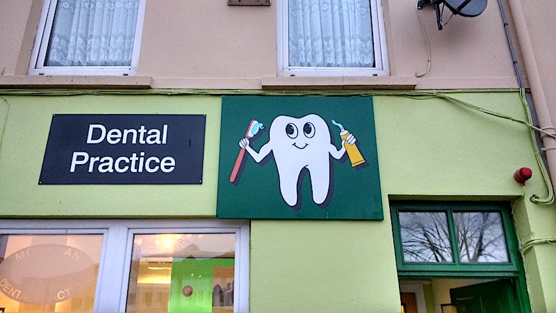

2019-02-15

# RangeError: Maximum call stack size exceeded

Seen in [Cork](https://en.wikipedia.org/wiki/Cork_(city)), Ireland today:

{:class="img-fluid"}

```
RangeError: Maximum call stack size exceeded
    at Tooth.brushTeeth (repl:1:13)
    at Tooth.brushTeeth (repl:1:18)
    at Tooth.brushTeeth (repl:1:18)
    at Tooth.brushTeeth (repl:1:18)
    at Tooth.brushTeeth (repl:1:18)
    at Tooth.brushTeeth (repl:1:18)
    at Tooth.brushTeeth (repl:1:18)
    at Tooth.brushTeeth (repl:1:18)
    at Tooth.brushTeeth (repl:1:18)
    at Tooth.brushTeeth (repl:1:18)
>
```

Always remember to brush your teeth, but also, always remember to include a base case!

<small>See also—"lather, rinse, repeat"</small>
